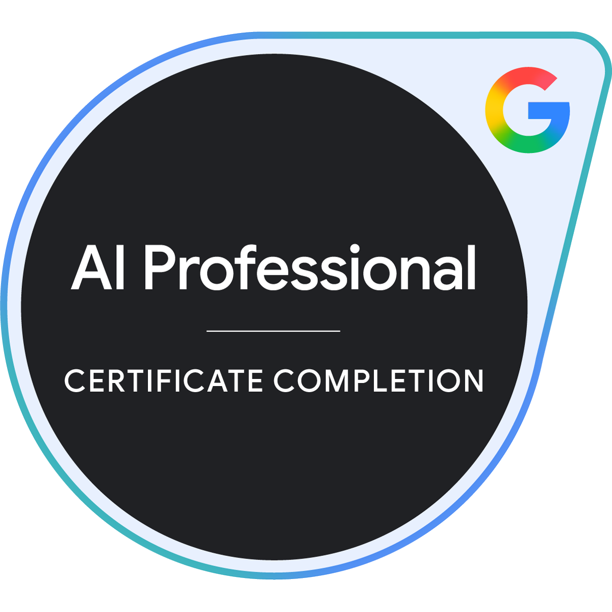

# Hi there, I'm mormor 👋

センサー信号処理やアルゴリズム開発を本業としつつ、趣味で「自分が欲しい便利ツール」を開発しているエンジニアです。  
特に画像や映像処理に関するソフトウェアを中心に個人開発を行っています。

*I am a software engineer specializing in sensor signal processing and algorithm development. As a hobby, I focus on building useful tools for my own needs, with a particular emphasis on image and video processing software.*

---

### 🚀 About Me

* 🛠️ **個人開発 / Hobby Projects**
  * 「自分が欲しい便利ツール」をテーマに、スクラッチ開発や自動化に取り組んでいます。主に **画像・映像処理ソフトウェア** を多く制作しています。
  * *I design and build tools and automation scripts to solve my own needs. Most of my projects are focused on image and video processing software.*

* ⚙️ **本職・専門分野 / Professional Background**
  * センサーデータの信号処理、フィルタ設計、および組み込み向けアルゴリズム開発を専門としています。
  * *My primary expertise lies in sensor data signal processing, digital filter design, and algorithm development optimized for embedded systems.*

* 🤖 **生成AIへの興味・活用 / Generative AI**
  * 生成AIを活用した開発支援や仕事効率化に加え、ComfyUIなどを用いた画像生成AIの実験・ワークフロー作成にも関心があり、日常的に学習・実践しています。
  * *I have a strong interest in leveraging generative AI for coding assistance and workflow optimization, as well as experimenting with image generation AI (e.g., ComfyUI) to build custom workflows.*

---

### 🛠️ Technologies & Tools

#### Languages & Technologies

#### Systems & Domains
* **信号処理 / Signal Processing**: Digital Signal Processing (DSP) / Filter Design / Algorithm Optimization
* **画像処理 / Image Processing**: OpenCV / Computer Vision / Image & Video Processing
* **その他 / Tools**: VS Code / GitHub Actions / Generative AI Tools (LLMs, ComfyUI)

---

### 🎓 Certifications

GoogleのAIプロフェッショナル認定資格を保有しており、生成AIや最新技術の活用に取り組んでいます。  
*I hold a Google AI Professional Certificate and am actively working on integrating generative AI and cutting-edge technologies into my workflows.*

---

### 📈 GitHub Stats

  
  

